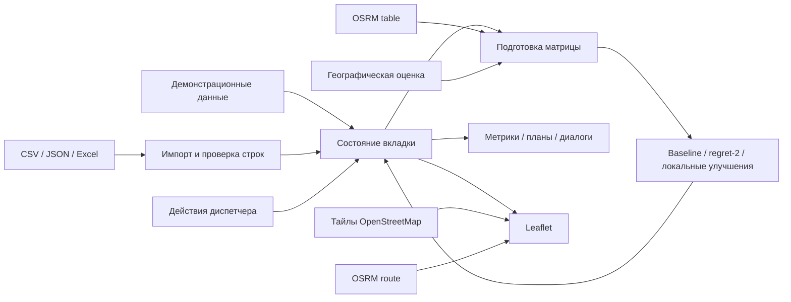

# Архитектура

[Документация](README.md) · [Алгоритмы](ALGORITHMS.md) · [Ограничения](VALIDATION.md)

## Компоненты

Версия 2 — одностраничное приложение без серверной бизнес-логики. HTML создаёт экран и диалоги, обычный JavaScript хранит данные, рассчитывает маршруты и обновляет DOM. HTTP-сервер только отдаёт статические файлы.

## Файлы

| Путь | Ответственность |
|---|---|
| [dist/index.html](../dist/index.html) | Экран, формы, диалоги, подключение внешних библиотек |
| [dist/app.js](../dist/app.js) | Данные, импорт, алгоритмы, обработчики событий, карта и метрики |
| [dist/styles.css](../dist/styles.css) | Основные стили |
| [dist/overrides.css](../dist/overrides.css) | Дополнительные стили версии 2 |
| [dist/assets/Нормативы.xlsx](../dist/assets/Нормативы.xlsx) | Скачиваемый справочник |
| [examples/](../examples/) | Файлы для проверки импорта |
| [materials/](../materials/) | Материалы задачи и проектные пояснения |
| [start-local.cmd](../start-local.cmd) | Windows-обёртка над Python HTTP-сервером |

## Состояние и сущности

Объект `state` в `app.js` является общим хранилищем приложения.

| Часть | Основные поля |
|---|---|
| Заявка | `id`, `bk`, `type`, `start`, `end`, `zone`, `address`, `skill`, `transport`, `duration`, `executionStatus`, `actualTime` |
| Инженер | `id`, `name`, `skills`, `transport`, `shift`, `start`, `coords`, `available`, `reserve`, `delay` |
| Назначение | Копия заявки и `planStart`, `planEnd`, `travel`, `travelKm`, `locked`, `selectionReason`; при ручном изменении — `manual` |
| Маршрут | `engineer`, `items`, `end`, `distance`, `manualOverload` |
| Управление | `currentTime`, `threshold`, `auto`, `planVersion`, `selectedEngineerId`, `routeFilter` |
| Расчёт | `travelNodes`, `travelMatrix`, `travelSource`, `baseline`, `localMoves`, `computeMs`, `unassigned` |
| Проверки и события | `qualityReport`, `auditLog`, `stressResult`, `newRequests` |

Плановое время и длительность хранятся в минутах, пользовательское время — строкой `HH:MM`. Расстояния маршрута — в километрах. Матрица OSRM содержит секунды и метры; единицы преобразуются в `travelLeg()`.

Хранилища на диске, `localStorage`, `sessionStorage` и серверной синхронизации нет. `planVersion` — локальный счётчик отдельных действий, не механизм разрешения конфликтов. `auditLog` находится только в памяти и не имеет отдельного экрана или экспорта.

## Потоки данных

### Открытие страницы

1. Создаются 10 демонстрационных заявок, 6 инженеров и встроенные нормативы.
2. `schedule('initial')` строит первый план по географической оценке.
3. `prepareTravelMatrix()` запрашивает дорожную матрицу.
4. После успешного ответа или перехода к резерву снова выполняется `schedule('initial')`.
5. `renderAll()` обновляет метрики, сравнение, график, маршруты, карту и списки.

Начальное текущее время — `14:30`, но стартовый расчёт принудительно утренний. Следующая кнопка «Рассчитать план» выбирает режим уже по текущему времени.

### Импорт и изменения

`rowsFromFile()` читает CSV/JSON либо Excel через SheetJS. Заявки проходят `normalizeRequests()` и `qualityGateRequests()`, инженеры проверяются в `handleFile()`. Если принятых строк нет, прежний набор сохраняется. Иначе принятые строки заменяют соответствующий набор и запускают `calculatePlan('initial')`.

`calculatePlan(mode)` сначала обновляет матрицу, затем вызывает `schedule(mode)`. Расчёт синхронный, в основном потоке браузера. Фонового рабочего процесса и очереди задач нет.

Факты исполнения обновляют и исходную заявку, и её копию в маршруте. Оперативное планирование фиксирует назначения по статусам, затем распределяет остальные заявки. Особенности фиксации описаны в [алгоритмах](ALGORITHMS.md).

## География и внешние сервисы

`coordFor()` берёт опорную точку района из `zoneCoords` и смещает её по числовой части ID. Адрес не участвует в вычислении координат. Для ID без числовой части смещение может зависеть от позиции, переданной вызывающей функцией. Стартовые координаты импортированных инженеров также синтетические.

Внутри приложения координаты представлены как `[широта, долгота]`. При обращении к OSRM они записываются как `долгота,широта`.

| Запрос | Назначение |
|---|---|
| `GET https://router.project-osrm.org/table/v1/driving/{coordinates}?annotations=duration,distance` | Матрица текущего расчёта; тайм-аут 9 секунд, при ошибке резерв |
| `GET https://router.project-osrm.org/route/v1/driving/{coordinates}?overview=full&geometries=geojson&steps=false` | Линия маршрута; тайм-аут 7 секунд, при ошибке пунктир между точками |
| `https://tile.openstreetmap.org/{z}/{x}/{y}.png` | Подложка Leaflet |

Матрица и геометрия карты запрашиваются отдельно. Успех загрузки линий не доказывает, что расчёт выполнен по дорожной матрице. Геометрия кэшируется в `roadCache` до обновления страницы; `mapRenderId` защищает от применения устаревшего ответа к новой карте.

## Интерфейсы интеграции

Собственных HTTP-эндпоинтов нет. При наличии `document.modelContext.registerTool` регистрируются два инструмента WebMCP:

| Инструмент | Вход и поведение |
|---|---|
| `configure_replanning_trigger` | `enabled: boolean`, `minutes: number` от 1 до 180; изменяет настройки, возвращает `enabled` и `threshold_minutes` |
| `run_manual_replanning` | Пустой объект; вызывает `schedule('operational')`, возвращает `version`, `assigned`, `unassigned`, `locked` |

Регистрация необязательна для обычного использования. Инструмент перепланирования использует уже имеющуюся матрицу; в отличие от кнопки интерфейса он не вызывает `prepareTravelMatrix()`.

## Где менять поведение

| Изменение | Функции и места |
|---|---|
| Импорт | `normalizeRequests`, `qualityGateRequests`, `handleFile` |
| Навык и длительность | `guessSkill`, `normFor`, `state.norms` |
| Приоритет | `basePriority`, `criticality` |
| Стоимость назначения | `choicesFor` |
| Назначение и пересчёт | `schedule`, `planBaseline`, `localImprove`, `simulateFuture` |
| Координаты и время пути | `zoneCoords`, `coordFor`, `prepareTravelMatrix`, `travelLeg`, `fallbackLeg` |
| Метрики | `summarizePlan`, `renderMetrics`, `refreshActualDelays` |
| Карта | `initMap`, `roadGeometry`, `renderMap` |

При доработке согласованно изменяйте автоназначение, обе формы ручного назначения и расчёт метрик. Сейчас эти пути содержат разные проверки; расхождения перечислены в [VALIDATION.md](VALIDATION.md).
